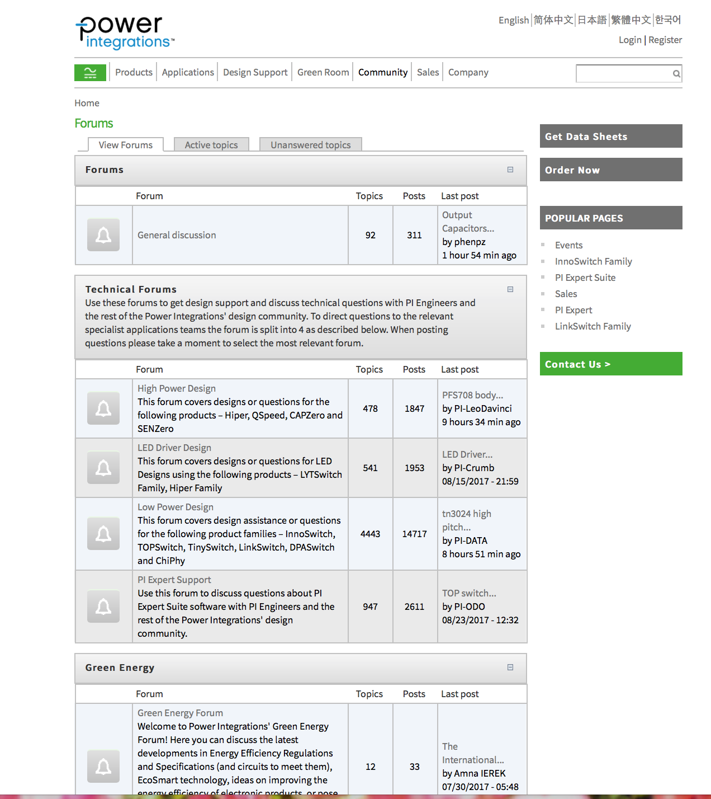
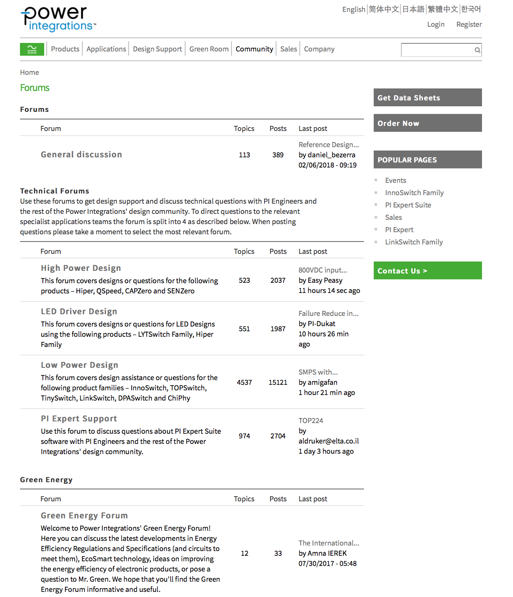
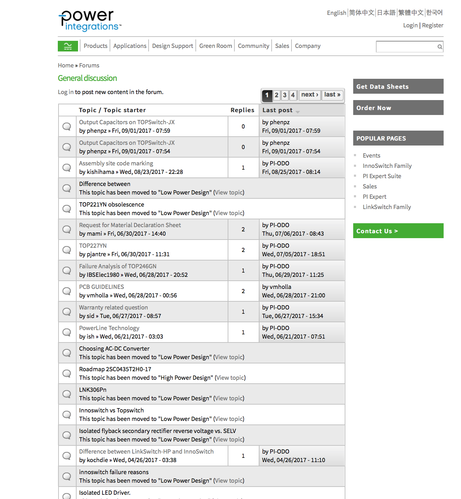
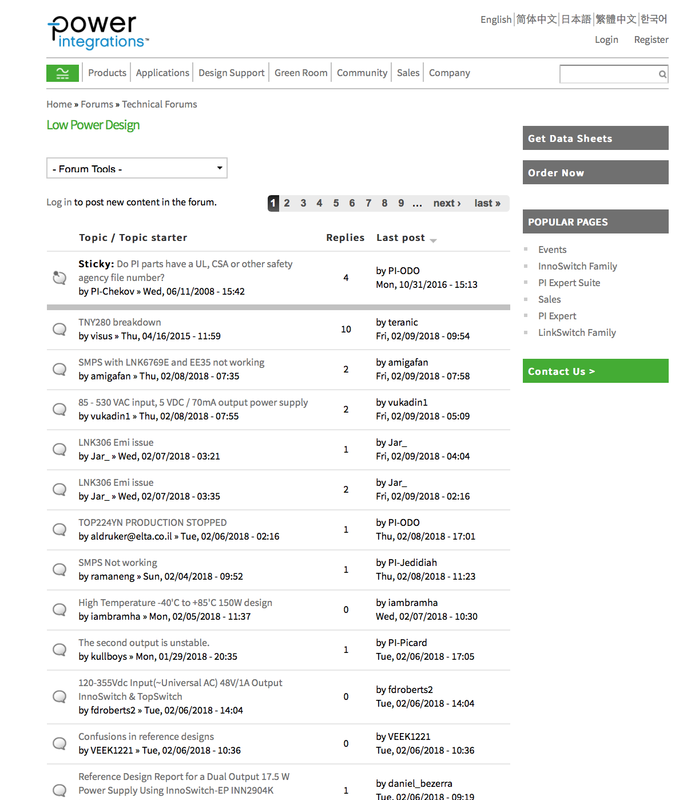
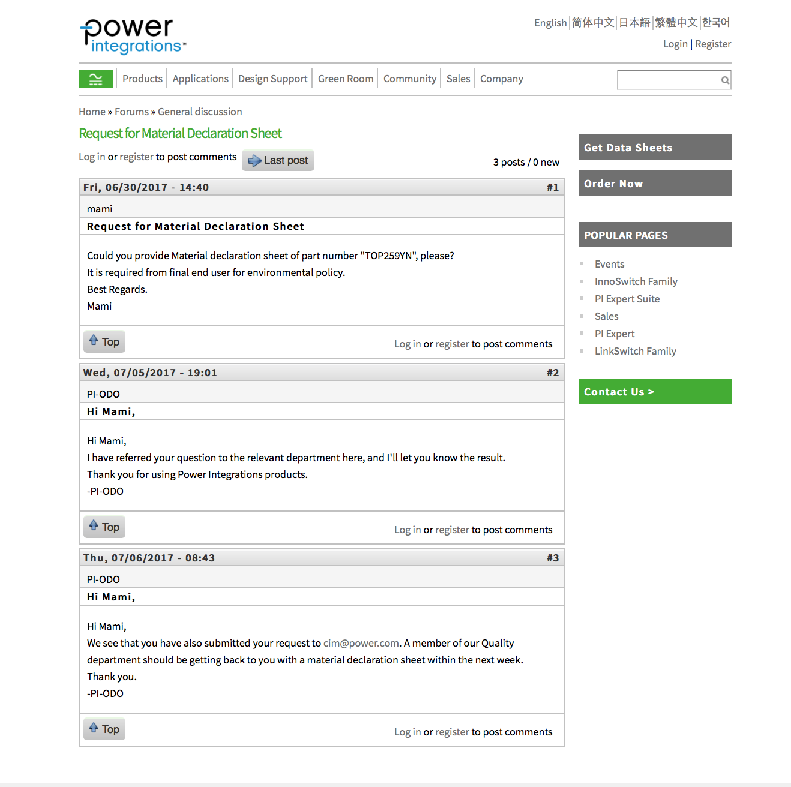
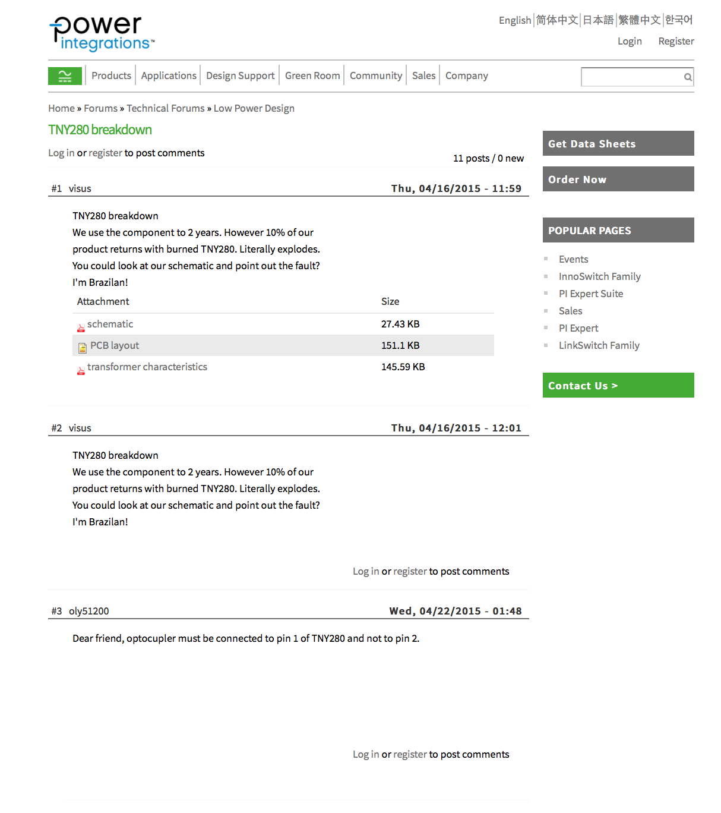

# Power Integrations Internship
Work from July 2017 to September 2017

## Redesign of Forum Section
This project was part of my internship with Power Integrations. I made improvements to the user experience of the forum section of their website. There was not a lot of room for big changes due to the limitations of their pre-existing Drupal theme; however, I was able to make substantial changes to the look and feel of the pages by editing the PHP templates and making CSS changes.

***

### Forum Index Page - Before

### Forum Index Page - After

***

### Topic Index Page - Before

### Topic Index Page - After

***

### Discussion Page - Before

### Discussion Page - After
